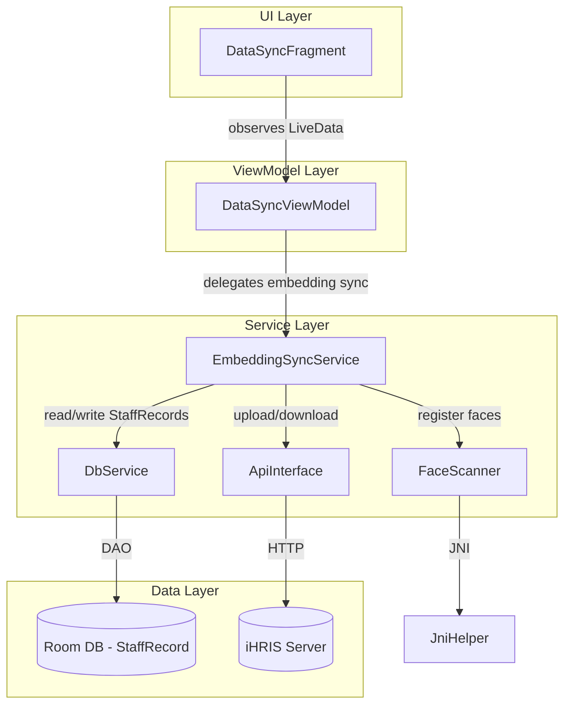
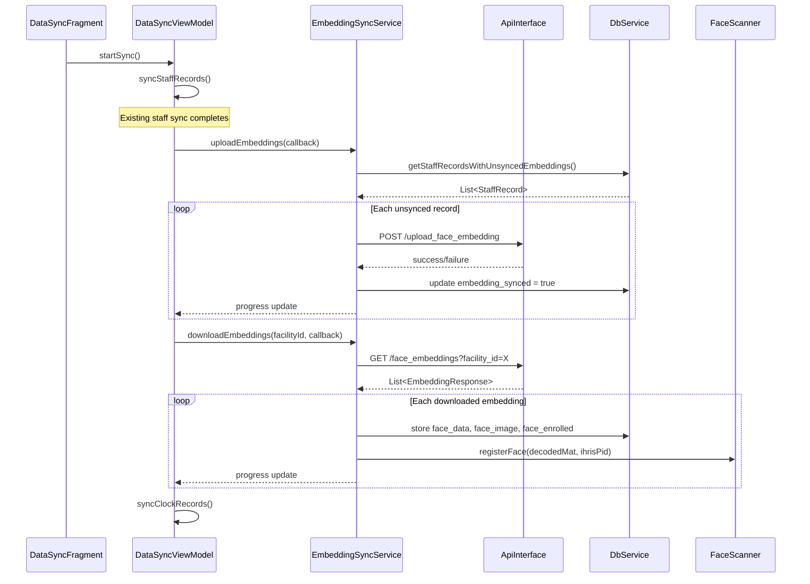

# Design Document: Face Embedding Sync

## Overview

This feature enables cross-device face recognition by syncing face embeddings (float arrays) between devices via the iHRIS server. Currently, a staff member enrolled on one device cannot be recognized on another because face embeddings are stored only locally. This design adds:

1. **Upload**: Devices with locally enrolled face embeddings upload them (as CSV strings) along with the face image and ihris_pid to the server.
2. **Download**: Devices pull face embeddings for their facility from the server and store them in the local Room database.
3. **Face Engine Registration**: Downloaded embeddings are registered with the on-device JNI face engine by decoding the synced Base64 face image, converting it to an OpenCV Mat, and calling the existing `FaceScanner.registerFace()` flow.
4. **Integration**: The embedding sync phase is inserted into the existing `DataSyncViewModel.performSync()` flow — after staff record sync, before clock history sync.

### Key Design Decision: Face Engine Registration Strategy

The JNI `FaceRegister` method requires a `Mat` (image) address and face boxes — it does not accept raw float[] embeddings directly. Three options were considered:

- **(a) New JNI method** for direct embedding registration — requires native C++ changes, high risk
- **(b) Write embeddings to face DB directory** in native engine format — undocumented format, fragile
- **(c) Re-register using the synced face_image** — decode Base64 JPEG → Bitmap → Mat → existing `registerFace()` flow

**Option (c) is chosen** because `face_image` (Base64 JPEG) is already stored on each StaffRecord and will be synced alongside the embedding. This avoids any native code changes and reuses the proven registration pipeline. The float[] embedding stored in `face_data` serves as the authoritative record for determining sync status, while the actual face engine registration uses the image.

## Architecture



### Sync Flow Sequence



### Architectural Decisions

1. **New `EmbeddingSyncService` class** rather than inlining logic in the ViewModel. This keeps the ViewModel thin and the sync logic testable independently.
2. **Callback-based async pattern** matching the existing `DbService.Callback<T>` convention — no RxJava or coroutines.
3. **`embedding_synced` field on StaffRecord** — a new boolean column separate from the existing `synced` field. The `synced` field tracks staff record sync to `/enroll_user`; `embedding_synced` tracks face data sync specifically.
4. **Facility-scoped download** — embeddings are downloaded filtered by `facility_id` from `SessionService`, matching the existing staff list scoping.

## Components and Interfaces

### EmbeddingSyncService (new)

The core service orchestrating upload and download of face embeddings.

```java
public class EmbeddingSyncService {
    private final ApiInterface apiService;
    private final DbService dbService;
    private final FaceScanner faceScanner;
    private final Context context;

    public EmbeddingSyncService(Context context, ApiInterface apiService,
                                 DbService dbService, FaceScanner faceScanner);

    // Upload all locally enrolled but unsynced embeddings
    public void uploadEmbeddings(EmbeddingSyncCallback callback);

    // Download embeddings for the given facility, store and register
    public void downloadEmbeddings(String facilityId, EmbeddingSyncCallback callback);

    public interface EmbeddingSyncCallback {
        void onProgress(int completed, int total, String message);
        void onComplete(int uploaded, int downloaded, List<String> errors);
        void onError(String errorMessage);
    }
}
```

### ApiInterface (modified — new endpoints)

```java
// Upload a face embedding to the server
@POST("upload_face_embedding")
Call<FaceUploadResponse> uploadFaceEmbedding(@Body FaceEmbeddingUploadRequest request);

// Download face embeddings for a facility
@GET("face_embeddings")
Call<FaceEmbeddingDownloadResponse> getFaceEmbeddings(@Query("facility_id") String facilityId);
```

### FaceEmbeddingUploadRequest (new model)

```java
public class FaceEmbeddingUploadRequest {
    @SerializedName("ihris_pid")
    private String ihrisPid;

    @SerializedName("face_data")
    private String faceData;       // CSV string from FloatArrayConverter

    @SerializedName("face_image")
    private String faceImage;      // Base64 JPEG string
}
```

### FaceEmbeddingDownloadResponse (new model)

```java
public class FaceEmbeddingDownloadResponse {
    @SerializedName("status")
    private String status;

    @SerializedName("embeddings")
    private List<FaceEmbeddingRecord> embeddings;
}
```

### FaceEmbeddingRecord (new model)

```java
public class FaceEmbeddingRecord {
    @SerializedName("ihris_pid")
    private String ihrisPid;

    @SerializedName("face_data")
    private String faceData;       // CSV string

    @SerializedName("face_image")
    private String faceImage;      // Base64 JPEG
}
```

### StaffRecordDao (modified — new queries)

```java
// Get staff records with face data that haven't been embedding-synced
@Query("SELECT * FROM staff_records WHERE face_enrolled = 1 AND face_data IS NOT NULL AND embedding_synced = 0")
List<StaffRecord> getStaffRecordsWithUnsyncedEmbeddings();

// Count of unsynced embeddings
@Query("SELECT COUNT(*) FROM staff_records WHERE face_enrolled = 1 AND face_data IS NOT NULL AND embedding_synced = 0")
int countUnsyncedEmbeddings();

// Count of synced embeddings
@Query("SELECT COUNT(*) FROM staff_records WHERE embedding_synced = 1")
int countSyncedEmbeddings();
```

### DbService (modified — new async methods)

```java
public void getStaffRecordsWithUnsyncedEmbeddingsAsync(Callback<List<StaffRecord>> callback);
public void countUnsyncedEmbeddingsAsync(Callback<Integer> callback);
public void countSyncedEmbeddingsAsync(Callback<Integer> callback);
```

### DataSyncViewModel (modified)

New LiveData fields:
- `embeddingSyncProgressLiveData: MutableLiveData<Integer>` — 0–100 progress for embedding sync phase
- `embeddingUploadCountLiveData: MutableLiveData<Integer>` — count of uploaded embeddings
- `embeddingDownloadCountLiveData: MutableLiveData<Integer>` — count of downloaded embeddings

Modified `performSync()` flow:
1. Sync staff records (existing)
2. **Upload embeddings** via `EmbeddingSyncService.uploadEmbeddings()`
3. **Download embeddings** via `EmbeddingSyncService.downloadEmbeddings()`
4. Sync clock records (existing)

If the embedding sync phase fails, the error is logged and clock sync proceeds (non-blocking).

### FaceScanner (modified — new method)

```java
// Register a face from a Base64 JPEG image string (for downloaded embeddings)
public String registerFaceFromBase64(String base64Image, String userId);
```

This method decodes the Base64 string to a Bitmap, converts to Mat, and delegates to the existing `registerFace(Mat, String)` method.

## Data Models

### StaffRecord (modified)

New column added:

```java
@SerializedName("embedding_synced")
@Expose
@ColumnInfo(name = "embedding_synced")
private boolean embeddingSynced = false;
```

With getter/setter:
```java
public boolean isEmbeddingSynced() { return embeddingSynced; }
public void setEmbeddingSynced(boolean embeddingSynced) { this.embeddingSynced = embeddingSynced; }
```

Since `AppDatabase` uses `fallbackToDestructiveMigration()`, adding this column is safe — the database will be recreated on version change. The database version should be incremented to 2.

### Upload Request/Response Models

**FaceEmbeddingUploadRequest**: `ihrisPid` (String), `faceData` (String — CSV), `faceImage` (String — Base64 JPEG)

**FaceUploadResponse** (existing): `status` (String), `message` (String) — reused for upload response.

### Download Response Models

**FaceEmbeddingDownloadResponse**: `status` (String), `embeddings` (List\<FaceEmbeddingRecord\>)

**FaceEmbeddingRecord**: `ihrisPid` (String), `faceData` (String — CSV), `faceImage` (String — Base64 JPEG)

### Serialization Flow

```
Upload:  float[] → FloatArrayConverter.toString() → CSV string → JSON field "face_data" → HTTP POST
Download: JSON field "face_data" → CSV string → FloatArrayConverter.fromString() → float[] → Room DB
```

The existing `FloatArrayConverter` handles all serialization. No new converters needed.
