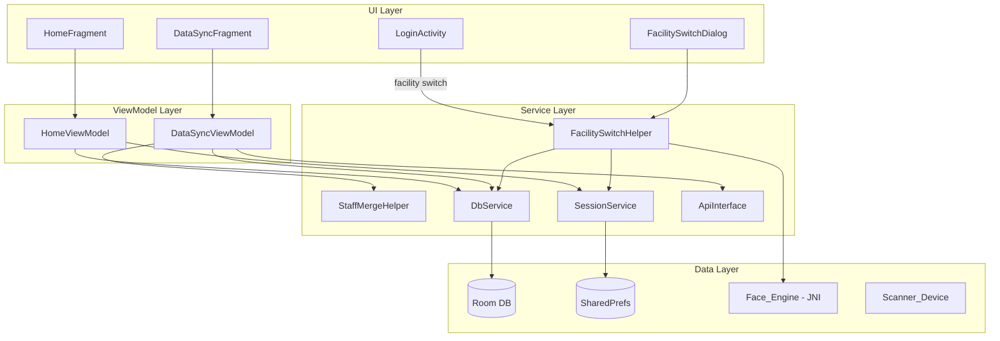
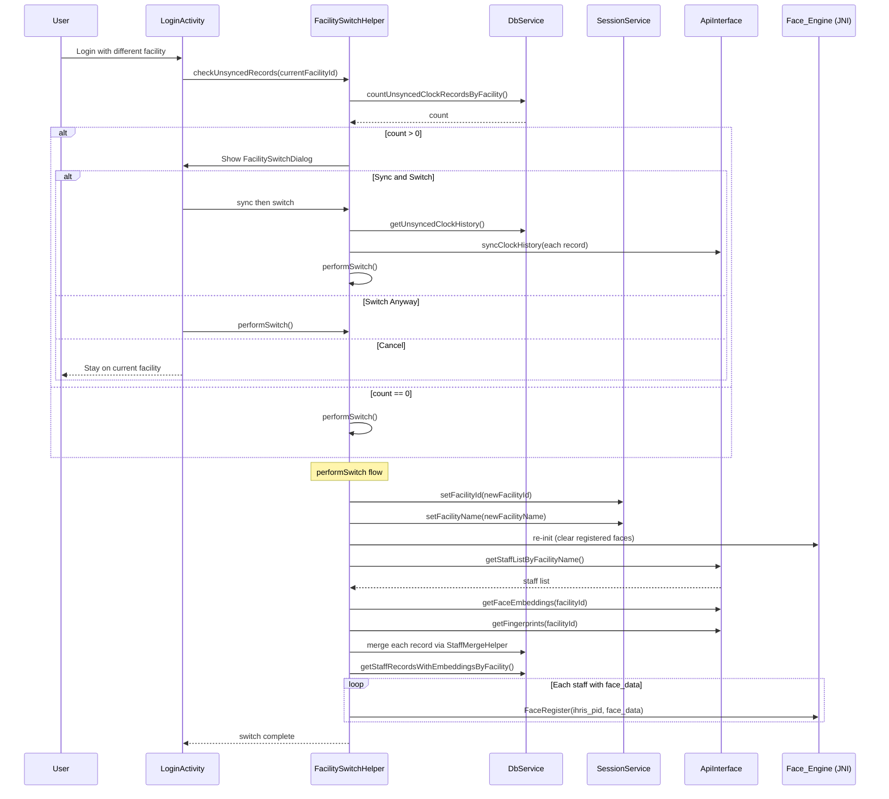

# Design Document: Facility Switch Data Portability

## Overview

This feature transforms the HRMAttend app from a single-facility-at-a-time model to a multi-facility data store. Currently, switching facilities (via login) overwrites or clears existing staff records and biometric data. The new design retains all downloaded data across facility switches, scopes the UI and biometric engines to the active facility, and extends the data sync process to download complete biometric data (face embeddings and fingerprint templates) alongside staff information.

Key changes:
1. Remove the `deleteAll()` call during facility switch so records from previous facilities persist.
2. Merge incoming staff records by `ihris_pid` (upsert), preserving locally enrolled biometric data.
3. Add facility-scoped DAO queries so the UI and Face_Engine only operate on the active facility's staff.
4. Extend the staff download to include face embeddings and fingerprint templates, and register them with the on-device recognition engines.
5. Add an unsynced-records confirmation dialog before facility switch.
6. Make the clock history sync upload records from all facilities, not just the active one.

## Architecture

The existing MVVM architecture is preserved. No new architectural patterns are introduced.



### Key Architectural Decisions

1. **Upsert by `ihris_pid` instead of `id`**: The current `StaffRecord` uses an integer `id` as `@PrimaryKey`. Since the same person can appear at multiple facilities, and `ihris_pid` is the true cross-facility identifier, the merge logic looks up by `ihris_pid` first. If a record exists, we update staff info fields and skip biometric fields that are already populated locally. If not, we insert a new record. This avoids changing the primary key (which would require a destructive migration) and instead uses application-level merge logic in `StaffMergeHelper`.

2. **No schema migration needed**: The existing `StaffRecord` and `ClockHistory` entities already have `facility_id` columns. The only changes are in DAO queries (adding `WHERE facility_id = :facilityId` variants) and application logic. `fallbackToDestructiveMigration()` remains as-is since no columns are added.

3. **Face_Engine scoping**: The JNI `FaceRegister` / `FaceRecognition` calls operate on an in-memory registry. On facility switch, we re-initialize the engine and register only the new facility's embeddings. This is simpler than maintaining a multi-facility in-memory index.

4. **Separate biometric download endpoints**: Rather than modifying the `staff_list` endpoint, we reuse the existing `GET /face_embeddings?facility_id=` and `GET /fingerprints?facility_id=` endpoints to fetch biometric data after the staff list download. This is backward-compatible and reuses infrastructure from the face-embedding-sync and fingerprint-sync specs.

## Components and Interfaces

### New Components

#### `FacilitySwitchHelper`

Utility class that orchestrates the facility switch workflow.

```java
public class FacilitySwitchHelper {
    private final DbService dbService;
    private final SessionService sessionService;

    // Check for unsynced clock records for the current facility
    public void checkUnsyncedRecords(String facilityId, DbService.Callback<Integer> callback);

    // Show confirmation dialog if unsynced records exist
    public void showSwitchConfirmationDialog(Activity activity, int unsyncedCount,
        Runnable onSyncFirst, Runnable onProceed, Runnable onCancel);

    // Execute the facility switch: update session, reload face engine, trigger staff download
    public void performSwitch(String newFacilityId, String newFacilityName,
        DbService.Callback<Boolean> callback);

    // Re-initialize Face_Engine with embeddings for the given facility
    public void reloadFaceEngine(String facilityId);
}
```

#### `StaffMergeHelper`

Pure utility class that encapsulates the merge logic for downloaded staff records. This is the core of the upsert-by-ihris_pid strategy.

```java
public class StaffMergeHelper {
    /**
     * Merges a server StaffRecord with a local StaffRecord.
     * - If local is null: returns the server record as-is (for insert).
     * - If local exists: updates staff info fields from server, preserves
     *   local biometric data if present, accepts server biometric data
     *   only when local fields are null.
     * Returns the merged record ready for dao.update() or dao.insert().
     */
    public static StaffRecord merge(@Nullable StaffRecord local, @NonNull StaffRecord server);
}
```

Merge algorithm pseudocode:

```
for each serverRecord in downloadedStaffList:
    localRecord = dao.getStaffRecordByIhrisPid(serverRecord.ihrisPid)
    if localRecord exists:
        localRecord.surname = serverRecord.surname
        localRecord.firstname = serverRecord.firstname
        localRecord.othername = serverRecord.othername
        localRecord.job = serverRecord.job
        localRecord.facility = serverRecord.facility
        localRecord.facilityId = serverRecord.facilityId
        if localRecord.faceData == null AND serverRecord.faceData != null:
            localRecord.faceData = serverRecord.faceData
            localRecord.faceEnrolled = true
        if localRecord.fingerprintData == null AND serverRecord.fingerprintData != null:
            localRecord.fingerprintData = serverRecord.fingerprintData
            localRecord.fingerprintEnrolled = true
        dao.update(localRecord)
    else:
        dao.insert(serverRecord)
```

### Modified Components

#### `StaffRecordDao` -- new facility-scoped queries

```java
@Query("SELECT * FROM staff_records WHERE facility_id = :facilityId")
List<StaffRecord> getStaffRecordsByFacility(String facilityId);

@Query("SELECT * FROM staff_records WHERE facility_id = :facilityId AND face_data IS NOT NULL")
List<StaffRecord> getStaffRecordsWithEmbeddingsByFacility(String facilityId);

@Query("SELECT * FROM staff_records WHERE facility_id = :facilityId AND fingerprint_data IS NOT NULL AND fingerprint_enrolled = 1")
List<StaffRecord> getStaffRecordsWithFingerprintsByFacility(String facilityId);

@Query("SELECT COUNT(*) FROM staff_records WHERE facility_id = :facilityId")
int countStaffRecordsByFacility(String facilityId);
```

The existing `getStaffRecordByIhrisPid(String)` query is already present and sufficient for merge lookups.

#### `ClockHistoryDao` -- facility-scoped unsynced count

```java
@Query("SELECT * FROM clock_history WHERE facility_id = :facilityId ORDER BY clock_time DESC")
List<ClockHistory> getClockHistoryByFacility(String facilityId);

@Query("SELECT COUNT(*) FROM clock_history WHERE facility_id = :facilityId AND synced = 0")
int countUnsyncedClockRecordsByFacility(String facilityId);
```

The existing `getUnsyncedClockHistory()` already returns all unsynced records regardless of `facility_id` -- no change needed for cross-facility sync uploads.

#### `DbService` -- new async wrappers

New methods mirror the DAO additions with the existing `Callback<T>` pattern:

```java
public void getStaffRecordsByFacilityAsync(String facilityId, Callback<List<StaffRecord>> callback);
public void getStaffRecordsWithEmbeddingsByFacilityAsync(String facilityId, Callback<List<StaffRecord>> callback);
public void getStaffRecordsWithFingerprintsByFacilityAsync(String facilityId, Callback<List<StaffRecord>> callback);
public void countUnsyncedClockRecordsByFacilityAsync(String facilityId, Callback<Integer> callback);
public void getClockHistoryByFacilityAsync(String facilityId, Callback<List<ClockHistory>> callback);
```

The existing `clearStaffListAsync()` (which calls `deleteAll()`) is NOT removed but is no longer called during facility switch. It remains available for a manual "clear all data" action in settings.

#### `DataSyncViewModel` -- modified sync logic

- `downloadStaffRecords()`: After downloading staff list, also fetches face embeddings (`GET /face_embeddings`) and fingerprint templates (`GET /fingerprints`) for the facility, then merges into local DB using `StaffMergeHelper`.
- `syncClockRecords()`: Uploads all unsynced `ClockHistory` records regardless of `facility_id`.
- `registerBiometricData()`: New method that registers downloaded face embeddings with `JniHelper.FaceRegister()` and fingerprint templates with the scanner device.

#### `HomeViewModel` -- facility-scoped loading

```java
// Modified: loadStaffRecords() now filters by active facility
private void loadStaffRecords() {
    String facilityId = sessionService.getFacilityId();
    dbService.getStaffRecordsByFacilityAsync(facilityId, records -> {
        staffRecords.postValue(records);
    });
}
```

#### `LoginActivity` -- facility switch integration

On successful login, if the `facility_id` differs from the current session, delegate to `FacilitySwitchHelper` instead of directly setting session values. This triggers the unsynced-records check and confirmation dialog flow.

### Interaction Flow: Facility Switch



## Data Models

### Existing Entities (No Schema Changes)

The `StaffRecord` and `ClockHistory` entities already contain all necessary fields. No new columns or tables are required.

**StaffRecord** key fields for this feature:
| Field | Type | Purpose |
|---|---|---|
| `ihris_pid` | String | Unique staff identifier, used as merge key |
| `facility_id` | String | Facility this record belongs to |
| `face_data` | float[] | Face embedding (via FloatArrayConverter) |
| `fingerprint_data` | byte[] | Fingerprint template (via ByteArrayConverter) |
| `face_enrolled` | boolean | Whether face data is present and usable |
| `fingerprint_enrolled` | boolean | Whether fingerprint data is present and usable |
| `face_image` | String | Base64-encoded face image |
| `template_id` | int | Local fingerprint scanner template slot ID |
| `embedding_synced` | boolean | Whether face embedding has been uploaded to server |
| `fingerprint_synced` | boolean | Whether fingerprint template has been uploaded to server |

**ClockHistory** key fields for this feature:
| Field | Type | Purpose |
|---|---|---|
| `facility_id` | String | Facility where this clock event occurred |
| `synced` | boolean | Whether this record has been uploaded to server |
| `ihris_pid` | String | Staff member who clocked in/out |

## Correctness Properties

*A property is a characteristic or behavior that should hold true across all valid executions of a system -- essentially, a formal statement about what the system should do. Properties serve as the bridge between human-readable specifications and machine-verifiable correctness guarantees.*

### Property 1: Facility switch preserves all staff records and biometric data

*For any* local Room database containing staff records from one or more facilities, performing a facility switch shall not delete, modify, or nullify any existing `StaffRecord` row or its biometric fields (`face_data`, `fingerprint_data`, `face_image`, `face_enrolled`, `fingerprint_enrolled`). The count and content of all staff records before and after the switch must be identical.

**Validates: Requirements 1.1, 1.4, 5.4**

### Property 2: Merge upserts by ihris_pid preserving local biometric data

*For any* local `StaffRecord` with biometric data and *any* server `StaffRecord` sharing the same `ihris_pid`, after the merge operation: (a) the staff information fields (`surname`, `firstname`, `othername`, `job`, `facility`, `facility_id`) must equal the server values, (b) the biometric fields (`face_data`, `fingerprint_data`, `face_image`) must equal the original local values, and (c) for a server record with a new `ihris_pid` not present locally, a new row is inserted with all server-provided fields.

**Validates: Requirements 1.2, 1.3, 3.4, 3.5**

### Property 3: Facility switch preserves all clock history records

*For any* local Room database containing clock history records from one or more facilities (both synced and unsynced), performing a facility switch shall not delete or modify any existing `ClockHistory` row. The count and content of all clock history records before and after the switch must be identical.

**Validates: Requirements 2.1, 2.2**

### Property 4: New clock records are tagged with the active facility

*For any* active facility ID and *any* clock-in or clock-out event, the resulting `ClockHistory` record's `facility_id` field must equal the active facility ID at the time the event was created.

**Validates: Requirements 2.3**

### Property 5: Biometric download sets enrollment flags correctly

*For any* server response containing a `FaceEmbeddingRecord` with non-null `face_data` and a matching local `StaffRecord` with null `face_data`, after processing: `face_data` must be non-null and `face_enrolled` must be `true`. The same applies symmetrically for `FingerprintRecord`: `fingerprint_data` must be non-null and `fingerprint_enrolled` must be `true`.

**Validates: Requirements 3.2, 3.3**

### Property 6: Facility-scoped queries return only matching records

*For any* database containing staff records from multiple facilities and *any* chosen `facility_id`, the facility-scoped DAO query `getStaffRecordsByFacility(facilityId)` must return exactly the set of records whose `facility_id` equals the given value -- no more, no less.

**Validates: Requirements 5.1, 5.2**

### Property 7: Sync uploads all unsynced clock records regardless of facility

*For any* database containing unsynced `ClockHistory` records across multiple facility IDs, the `getUnsyncedClockHistory()` query must return all of them without filtering by `facility_id`.

**Validates: Requirements 7.1**

### Property 8: Clock history serialization includes facility_id

*For any* `ClockHistory` record with a non-null `facility_id`, serializing it to JSON via Gson must produce a JSON string that contains the `facility_id` field with the correct value.

**Validates: Requirements 7.2**

### Property 9: Sync completion marks all uploaded records as synced

*For any* set of `ClockHistory` records successfully uploaded to the server (regardless of their `facility_id`), after sync completion all of those records must have `synced = true`.

**Validates: Requirements 7.3**

### Property 10: FloatArrayConverter round-trip

*For any* valid `float[]` (including empty arrays and arrays with special float values like 0.0, negative values, and very small/large values), `FloatArrayConverter.fromString(FloatArrayConverter.toString(array))` must produce a `float[]` that is element-wise equal to the original.

**Validates: Requirements 8.1, 8.3**

### Property 11: ByteArrayConverter round-trip

*For any* valid `byte[]` (including empty arrays and arrays with all possible byte values 0x00-0xFF), `ByteArrayConverter.fromString(ByteArrayConverter.toString(array))` must produce a `byte[]` that is element-wise equal to the original.

**Validates: Requirements 8.2, 8.4**

## Error Handling

| Scenario | Handling |
|---|---|
| Face_Engine fails to register a downloaded embedding | Log error with `ihris_pid` via Sentry, skip that record, continue with remaining registrations. The `face_enrolled` flag remains `true` (data is stored), but the staff member won't be recognized until the engine is reloaded. |
| Scanner_Device not connected during fingerprint download | Store `fingerprint_data` and set `fingerprint_enrolled = true` in Room. On scanner connect event, query `getStaffRecordsWithUnregisteredFingerprints()` and register pending templates. |
| Network failure during staff download | Retain all existing local data. Show error toast. User can retry via the sync button. |
| Network failure during clock history upload | Records remain with `synced = false`. Next sync attempt will pick them up again. |
| Merge conflict: server record has different `id` but same `ihris_pid` | Application-level merge uses `ihris_pid` lookup, not `id`. The local record's `id` is preserved; server `id` is ignored during merge. |
| Null biometric data from server | Merge logic skips null fields -- local biometric data (if any) is preserved, otherwise fields remain null. |
| FloatArrayConverter receives malformed CSV string | `Float.parseFloat()` throws `NumberFormatException`. Wrap in try-catch, log via Sentry, return null. |
| ByteArrayConverter receives invalid Base64 string | `Base64.decode()` throws `IllegalArgumentException`. Wrap in try-catch, log via Sentry, return null. |
| Facility switch with no network connectivity | Switch proceeds locally (session update + face engine reload). Staff download for new facility is skipped; user can sync later when connectivity is restored. |

## Testing Strategy

### Property-Based Testing

Use **jqwik** (already planned per AGENTS.md) as the property-based testing library for JVM/Android unit tests.

Each correctness property maps to a single jqwik `@Property` test with a minimum of 100 trials. Tests are tagged with comments referencing the design property.

| Property | Test Approach |
|---|---|
| P1: Staff record preservation | Generate random `StaffRecord` lists with varied `facility_id` values. Simulate facility switch (no-op on data layer). Verify all records unchanged. |
| P2: Merge upsert logic | Generate pairs of (local record with biometrics, server record with same `ihris_pid`). Run `StaffMergeHelper.merge()`. Assert staff info matches server, biometrics match local. Also test new `ihris_pid` insertion. |
| P3: Clock history preservation | Generate random `ClockHistory` lists. Simulate facility switch. Verify all records unchanged. |
| P4: Clock facility tagging | Generate random facility IDs and clock events. Verify `facility_id` on created records. |
| P5: Biometric download flags | Generate `FaceEmbeddingRecord`/`FingerprintRecord` with random data. Process against local records with null biometric fields. Verify flags set correctly. |
| P6: Facility-scoped filtering | Generate mixed `StaffRecord` list with multiple `facility_id` values. Filter by one. Verify exact match. |
| P7: Unsynced clock query | Generate `ClockHistory` records with varied `facility_id` and `synced` values. Query unsynced. Verify all unsynced returned regardless of facility. |
| P8: Clock JSON serialization | Generate `ClockHistory` with random `facility_id`. Serialize to JSON. Parse and verify `facility_id` present and correct. |
| P9: Sync marks all synced | Generate `ClockHistory` records across facilities. Simulate successful upload. Verify all marked `synced = true`. |
| P10: FloatArrayConverter round-trip | Generate random `float[]` arrays. Round-trip through `toString` then `fromString`. Assert element-wise equality. |
| P11: ByteArrayConverter round-trip | Generate random `byte[]` arrays. Round-trip through `toString` then `fromString`. Assert element-wise equality. |

### Unit Tests (Examples and Edge Cases)

- Merge with empty local database (all inserts, no updates)
- Merge with server returning empty staff list (no changes to local data)
- Merge where server record has null biometric fields and local has biometric data (local preserved)
- Merge where both local and server have biometric data (local wins)
- `FloatArrayConverter` with null input returns null
- `ByteArrayConverter` with null input returns null
- `FloatArrayConverter` with empty array round-trips correctly
- Facility switch confirmation dialog shown when unsynced count > 0
- Facility switch confirmation dialog not shown when unsynced count == 0
- Face engine re-initialization loads only new facility's embeddings
- Clock history upload includes records from multiple facilities in a single sync

### Test Configuration

- Library: **jqwik** (JUnit 5 platform, compatible with Android unit tests via pure JVM tests)
- Minimum iterations: 100 per `@Property` test
- Tag format: `// Feature: facility-switch-data-portability, Property {N}: {title}`
- Test location: `app/src/test/java/ug/go/health/ihrisbiometric/`
- Each correctness property is implemented by a single `@Property` test method
