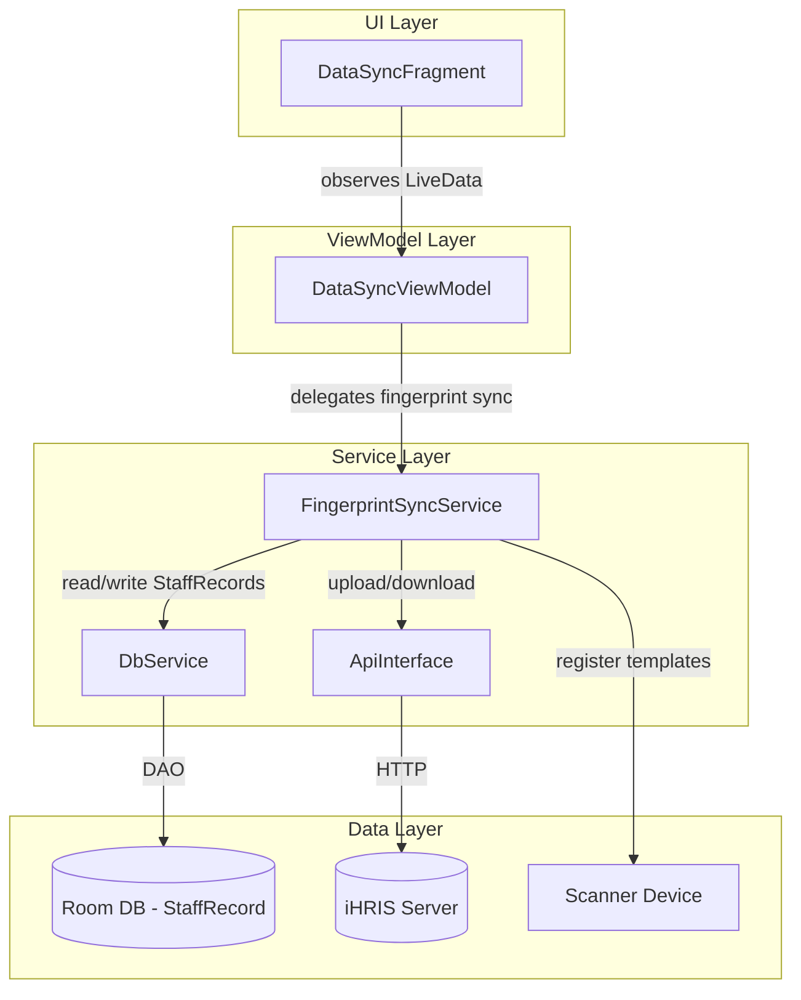
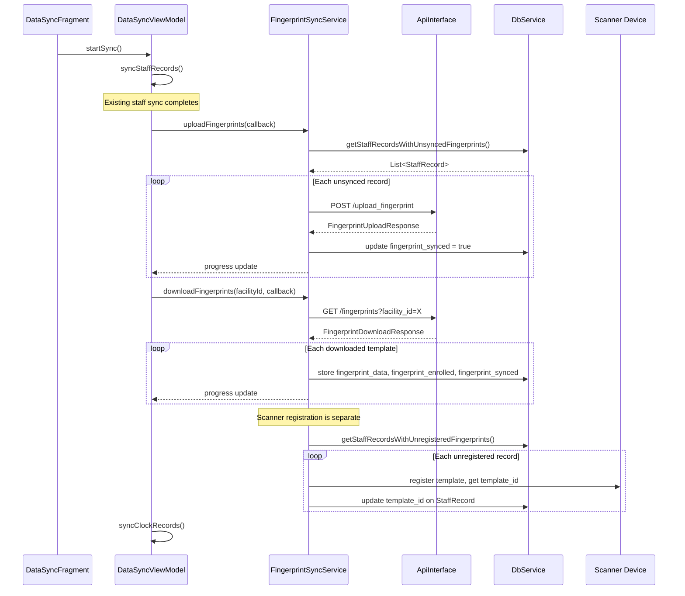

# Design Document: Fingerprint Sync

## Overview

This feature enables cross-device fingerprint recognition by syncing fingerprint templates (byte arrays) between devices via the iHRIS server. Currently, a staff member enrolled on one device's fingerprint scanner cannot be recognized on another device because fingerprint templates are stored only locally. This design adds:

1. **Upload**: Devices with locally enrolled fingerprint templates upload them (as Base64 strings) along with the ihris_pid to the server.
2. **Download**: Devices pull fingerprint templates for their facility from the server and store them in the local Room database.
3. **Scanner Registration**: Downloaded templates are registered on the local serial port fingerprint scanner device, with a `template_id` assigned for on-device recognition lookups.
4. **Integration**: The fingerprint sync phase is inserted into the existing `DataSyncViewModel.performSync()` flow — after staff record sync, before clock history sync.

### Key Design Decision: Scanner Registration Strategy

The fingerprint scanner hardware communicates via serial port (`android_serialport_api`). Downloaded templates must be written to the scanner device so it can perform on-device matching during clock-in/clock-out. Two options were considered:

- **(a) Register templates immediately after download** — requires the scanner to be connected at sync time.
- **(b) Store templates locally and register lazily when scanner is available** — more resilient to scanner disconnection.

**Option (b) is chosen** because the scanner may not be connected during a data sync (e.g., syncing over WiFi without the USB scanner attached). Templates are stored in the Room database immediately on download. A separate registration pass runs when the scanner is detected as connected, iterating over records that have `fingerprint_data` but no valid `template_id`. This matches the resilience pattern expected in field deployments where hardware availability is intermittent.

### Key Design Decision: Separate Sync Status Field

A new `fingerprint_synced` boolean column is added to `StaffRecord` rather than reusing the existing `synced` field. The `synced` field tracks staff record sync to `/enroll_user`; `fingerprint_synced` tracks fingerprint template sync specifically. This avoids coupling the two sync lifecycles and allows fingerprint sync to operate independently.

## Architecture



### Sync Flow Sequence



### Architectural Decisions

1. **New `FingerprintSyncService` class** — keeps sync logic out of the ViewModel and testable independently. Mirrors the `EmbeddingSyncService` pattern from face-embedding-sync.
2. **Callback-based async pattern** — matches the existing `DbService.Callback<T>` convention used throughout the app.
3. **`fingerprint_synced` field on StaffRecord** — separate from `synced` to decouple fingerprint sync lifecycle from staff record sync.
4. **Facility-scoped download** — templates are downloaded filtered by `facility_id` from `SessionService`, matching existing staff list scoping.
5. **Lazy scanner registration** — templates are stored in Room immediately on download; scanner registration happens as a separate pass when hardware is available.

## Components and Interfaces

### FingerprintSyncService (new)

The core service orchestrating upload, download, and scanner registration of fingerprint templates.

```java
public class FingerprintSyncService {
    private final ApiInterface apiService;
    private final DbService dbService;
    private final Context context;

    public FingerprintSyncService(Context context, ApiInterface apiService, DbService dbService);

    // Upload all locally enrolled but unsynced fingerprint templates
    public void uploadFingerprints(FingerprintSyncCallback callback);

    // Download fingerprint templates for the given facility, store locally
    public void downloadFingerprints(String facilityId, FingerprintSyncCallback callback);

    // Register stored templates on the scanner device (call when scanner is connected)
    public void registerTemplatesOnScanner(ScannerRegistrationCallback callback);

    public interface FingerprintSyncCallback {
        void onProgress(int completed, int total, String message);
        void onComplete(int uploaded, int downloaded, List<String> errors);
        void onError(String errorMessage);
    }

    public interface ScannerRegistrationCallback {
        void onProgress(int completed, int total, String ihrisPid);
        void onComplete(int registered, List<String> failures);
        void onError(String errorMessage);
    }
}
```

### ApiInterface (modified — new endpoints)

```java
// Upload a fingerprint template to the server
@POST("upload_fingerprint")
Call<FingerprintUploadResponse> uploadFingerprint(@Body FingerprintUploadRequest request);

// Download fingerprint templates for a facility
@GET("fingerprints")
Call<FingerprintDownloadResponse> getFingerprints(@Query("facility_id") String facilityId);
```

### FingerprintUploadRequest (new model)

```java
public class FingerprintUploadRequest {
    @SerializedName("ihris_pid")
    private String ihrisPid;

    @SerializedName("fingerprint_data")
    private String fingerprintData;  // Base64 string from ByteArrayConverter
}
```

### FingerprintDownloadResponse (new model)

```java
public class FingerprintDownloadResponse {
    @SerializedName("status")
    private String status;

    @SerializedName("message")
    private String message;

    @SerializedName("fingerprints")
    private List<FingerprintRecord> fingerprints;
}
```

### FingerprintRecord (new model)

```java
public class FingerprintRecord {
    @SerializedName("ihris_pid")
    private String ihrisPid;

    @SerializedName("fingerprint_data")
    private String fingerprintData;  // Base64 string
}
```

### StaffRecordDao (modified — new queries)

```java
// Get staff records with fingerprint data that haven't been fingerprint-synced
@Query("SELECT * FROM staff_records WHERE fingerprint_enrolled = 1 AND fingerprint_data IS NOT NULL AND fingerprint_synced = 0")
List<StaffRecord> getStaffRecordsWithUnsyncedFingerprints();

// Get staff records with fingerprint data but no scanner template_id assigned
@Query("SELECT * FROM staff_records WHERE fingerprint_enrolled = 1 AND fingerprint_data IS NOT NULL AND template_id = 0")
List<StaffRecord> getStaffRecordsWithUnregisteredFingerprints();

// Count of unsynced fingerprints
@Query("SELECT COUNT(*) FROM staff_records WHERE fingerprint_enrolled = 1 AND fingerprint_data IS NOT NULL AND fingerprint_synced = 0")
int countUnsyncedFingerprints();

// Count of synced fingerprints
@Query("SELECT COUNT(*) FROM staff_records WHERE fingerprint_synced = 1")
int countSyncedFingerprints();
```

### DbService (modified — new async methods)

```java
public void getStaffRecordsWithUnsyncedFingerprintsAsync(Callback<List<StaffRecord>> callback);
public void getStaffRecordsWithUnregisteredFingerprintsAsync(Callback<List<StaffRecord>> callback);
public void countUnsyncedFingerprintsAsync(Callback<Integer> callback);
public void countSyncedFingerprintsAsync(Callback<Integer> callback);
```

### DataSyncViewModel (modified)

New LiveData fields:
- `fingerprintSyncProgressLiveData: MutableLiveData<Integer>` — 0–100 progress for fingerprint sync phase
- `fingerprintUploadCountLiveData: MutableLiveData<Integer>` — count of uploaded templates
- `fingerprintDownloadCountLiveData: MutableLiveData<Integer>` — count of downloaded templates

Modified `performSync()` flow:
1. Sync staff records (existing)
2. **Upload fingerprints** via `FingerprintSyncService.uploadFingerprints()`
3. **Download fingerprints** via `FingerprintSyncService.downloadFingerprints()`
4. **Register on scanner** via `FingerprintSyncService.registerTemplatesOnScanner()` (if scanner connected)
5. Sync clock records (existing)

If the fingerprint sync phase fails, the error is logged and clock sync proceeds (non-blocking).

### DataSyncFragment (modified)

New UI elements:
- `fingerprintProgressBar: ProgressBar` — progress bar for fingerprint sync phase
- Fingerprint sync messages integrated into the existing `syncMessagesListView`
- Fingerprint sync counts displayed alongside staff and clock counts

## Data Models

### StaffRecord (modified)

New column added:

```java
@SerializedName("fingerprint_synced")
@Expose
@ColumnInfo(name = "fingerprint_synced")
private boolean fingerprintSynced = false;
```

With getter/setter:
```java
public boolean isFingerprintSynced() { return fingerprintSynced; }
public void setFingerprintSynced(boolean fingerprintSynced) { this.fingerprintSynced = fingerprintSynced; }
```

Since `AppDatabase` uses `fallbackToDestructiveMigration()`, adding this column is safe — the database will be recreated on version change. The database version should be incremented (coordinated with face-embedding-sync if both land together).

### Existing Fields Used

- `fingerprint_data` (byte[]) — the raw fingerprint template, serialized via `ByteArrayConverter` to Base64
- `fingerprint_enrolled` (boolean) — whether the staff member has a fingerprint enrolled
- `template_id` (int) — the scanner-local ID assigned during registration (0 = unregistered)
- `ihris_pid` (String) — unique staff identifier for cross-device matching
- `facility_id` (String) — used to scope downloads to the relevant facility

### Upload Request/Response Models

**FingerprintUploadRequest**: `ihrisPid` (String), `fingerprintData` (String — Base64)

**FingerprintUploadResponse** (existing): `status` (String), `message` (String) — reused for upload response.

### Download Response Models

**FingerprintDownloadResponse**: `status` (String), `message` (String), `fingerprints` (List\<FingerprintRecord\>)

**FingerprintRecord**: `ihrisPid` (String), `fingerprintData` (String — Base64)

### Serialization Flow

```
Upload:  byte[] → ByteArrayConverter.toString() → Base64 string → JSON field "fingerprint_data" → HTTP POST
Download: JSON field "fingerprint_data" → Base64 string → ByteArrayConverter.fromString() → byte[] → Room DB
```

The existing `ByteArrayConverter` handles all serialization. No new converters needed.


## Correctness Properties

*A property is a characteristic or behavior that should hold true across all valid executions of a system — essentially, a formal statement about what the system should do. Properties serve as the bridge between human-readable specifications and machine-verifiable correctness guarantees.*

### Property 1: ByteArrayConverter round-trip

*For any* byte array (including empty arrays), converting to a Base64 string via `ByteArrayConverter.toString()` and then back via `ByteArrayConverter.fromString()` should produce a byte array that is element-wise equal to the original. Additionally, null input should produce null output in both directions.

**Validates: Requirements 4.1, 4.2, 4.3, 4.4**

### Property 2: Upload filter selects only eligible records

*For any* collection of StaffRecords with varying combinations of `fingerprint_enrolled`, `fingerprint_data`, and `fingerprint_synced` values, the upload selection query should return exactly those records where `fingerprint_enrolled` is true AND `fingerprint_data` is not null AND `fingerprint_synced` is false. No other records should be included, and no eligible records should be excluded.

**Validates: Requirements 1.1, 5.1**

### Property 3: Successful upload transitions sync status

*For any* StaffRecord that is uploaded and receives a success response from the server, the `fingerprint_synced` field should be set to true in the local database after the upload completes.

**Validates: Requirements 1.2**

### Property 4: Failed upload preserves unsynced status

*For any* StaffRecord where the upload fails (server error or network failure), the `fingerprint_synced` field should remain false, and the record should still be eligible for upload on the next sync cycle.

**Validates: Requirements 1.3, 1.4**

### Property 5: Incremental download preserves local data and fills gaps

*For any* set of server fingerprint records and local StaffRecords, after a download operation: (a) any local StaffRecord that already had `fingerprint_data` with `fingerprint_synced` set to true should have its `fingerprint_data` unchanged, and (b) any local StaffRecord that had no `fingerprint_data` but has a matching server record should now have the server's `fingerprint_data` stored with `fingerprint_enrolled` set to true and `fingerprint_synced` set to true.

**Validates: Requirements 2.3, 5.2, 5.3, 5.4**

### Property 6: Scanner registration assigns template_id

*For any* StaffRecord with `fingerprint_data` present and `template_id` equal to 0, after successful scanner registration, the `template_id` should be assigned a non-zero value.

**Validates: Requirements 3.1**

### Property 7: Scanner registration failure is non-blocking

*For any* batch of StaffRecords being registered on the scanner, if registration fails for one record, the remaining records in the batch should still be attempted. The count of successfully registered records plus the count of failed records should equal the total batch size.

**Validates: Requirements 3.3**

### Property 8: Progress callbacks report accurate counts

*For any* fingerprint sync operation processing N total records, the progress callback should be invoked with monotonically increasing `completed` values from 0 to N, and the `total` parameter should remain constant at N throughout the operation.

**Validates: Requirements 6.1**

### Property 9: Fingerprint sync failure does not block remaining sync phases

*For any* data sync workflow where the fingerprint sync phase fails, the clock history sync phase should still execute. The overall sync should report the fingerprint failure but not skip subsequent phases.

**Validates: Requirements 7.3**

## Error Handling

### Upload Errors

- **Server error response (non-2xx)**: Log the error message from the response body. Keep `fingerprint_synced = false` on the affected record. Continue uploading remaining records. Report the failure in the sync messages list.
- **Network failure (no response)**: Same handling as server error — keep unsynced, log, continue with remaining records. The record will be retried on the next sync cycle since it remains in the unsynced query results.
- **Serialization error (ByteArrayConverter failure)**: Should not occur with valid byte[] data. If it does, log the error with the ihris_pid and skip the record.

### Download Errors

- **Server error response**: Log the error. Report to the user via sync messages. Allow retry via the sync button.
- **Network failure**: Same as server error. The download can be retried on the next sync.
- **Empty response**: Not an error — report "No fingerprint templates available for download" in sync messages.
- **Deserialization error (invalid Base64)**: Log the error with the ihris_pid. Skip the record and continue processing remaining records.
- **Missing local StaffRecord for ihris_pid**: Skip the downloaded record (the staff member may not be assigned to this facility). Log for debugging.

### Scanner Registration Errors

- **Scanner not connected**: Store templates in Room database. Registration will be attempted when the scanner becomes available (lazy registration pattern).
- **Registration failure for individual template**: Log the failure with ihris_pid. Skip to the next record. Do not interrupt the batch.
- **Serial port communication error**: Log the error. Stop the registration batch and report partial results. Templates remain in the database for retry.

### Sync Workflow Errors

- **Fingerprint sync phase failure**: Log the error. Post failure message to `syncMessagesLiveData`. Proceed to clock history sync. The overall sync status should reflect the partial failure but not block completion of remaining phases.

## Testing Strategy

### Property-Based Testing

Property-based tests will use **jqwik** (net.jqwik:jqwik:1.9.1) as the PBT library for JVM/Java. Each property test will run a minimum of 100 iterations with randomly generated inputs.

Add to `app/build.gradle`:
```groovy
testImplementation 'net.jqwik:jqwik:1.9.1'
```

Each property test must be tagged with a comment referencing the design property:
```java
// Feature: fingerprint-sync, Property 1: ByteArrayConverter round-trip
```

**Property tests to implement:**

1. **ByteArrayConverter round-trip** (Property 1): Generate random byte arrays of varying lengths (0–10000 bytes). Verify `fromString(toString(bytes))` equals the original. Verify null handling. Edge cases: empty array, single byte, large arrays.

2. **Upload filter correctness** (Property 2): Generate random lists of StaffRecords with varying field combinations. Apply the DAO query logic (or equivalent filter function) and verify the result set matches the expected filter criteria exactly.

3. **Successful upload state transition** (Property 3): Generate random StaffRecords. Simulate successful upload. Verify `fingerprint_synced` becomes true.

4. **Failed upload preserves state** (Property 4): Generate random StaffRecords. Simulate failed upload. Verify `fingerprint_synced` remains false.

5. **Incremental download logic** (Property 5): Generate random sets of local StaffRecords and server FingerprintRecords. Apply the download/merge logic. Verify local data is preserved where it existed, and gaps are filled from server data.

6. **Scanner registration assigns template_id** (Property 6): Generate random StaffRecords with fingerprint_data and template_id=0. Simulate successful registration. Verify template_id becomes non-zero.

7. **Scanner registration fault tolerance** (Property 7): Generate random batches with some records configured to fail registration. Verify all records are attempted and counts are correct.

8. **Progress callback accuracy** (Property 8): Generate random batch sizes. Simulate sync operations. Verify progress callbacks are monotonically increasing and total is constant.

9. **Workflow resilience** (Property 9): Simulate fingerprint sync failure within the data sync workflow. Verify clock sync still executes.

### Unit Testing

Unit tests complement property tests by covering specific examples and integration points:

- **ByteArrayConverter**: Known Base64 strings decode to expected byte arrays (specific examples).
- **FingerprintUploadRequest serialization**: Verify Gson serializes the request model correctly with known values.
- **FingerprintDownloadResponse deserialization**: Verify Gson deserializes a known JSON response into the correct model.
- **StaffRecordDao queries**: Verify the new DAO queries return correct results with a pre-populated in-memory Room database.
- **DataSyncViewModel workflow ordering**: Verify that fingerprint sync is called after staff sync and before clock sync using mock services.
- **FingerprintSyncService.uploadFingerprints**: Verify correct API calls are made with mocked ApiInterface.
- **FingerprintSyncService.downloadFingerprints**: Verify correct storage and state updates with mocked dependencies.
- **Empty download response handling**: Verify the "no templates available" message is reported.
- **Scanner disconnected scenario**: Verify templates are stored locally without attempting registration.
