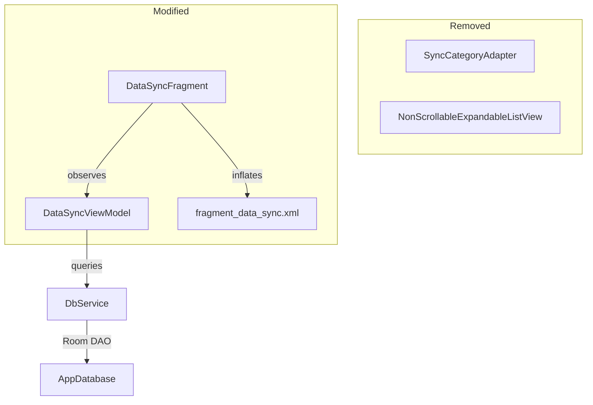

# Design Document: Sync UI Cleanup

## Overview

This design simplifies the HRMAttend Data Sync screen from a cluttered multi-card, multi-progress-bar layout into a clean, glanceable interface. The current screen shows four separate count TextViews (synced/unsynced × staff/clock), two progress bars, an always-visible raw log ListView, and an expandable record list. The redesign replaces this with:

- A single status banner communicating sync state via color and icon
- Two summary cards showing only pending counts per category
- One combined progress bar with a text label
- A collapsible sync log (collapsed by default)
- Removal of all expandable individual record lists

The changes are confined to the presentation layer: `DataSyncFragment`, `DataSyncViewModel` (new LiveData for combined progress and status text), the XML layout, and the `SyncCategoryAdapter` (which will be removed). No backend sync logic, API calls, or Room entities change.

## Architecture

The existing MVVM architecture is preserved. The fragment observes LiveData from the ViewModel, and the ViewModel queries the database via `DbService`.



Key architectural decisions:

1. The ViewModel gains a new `MediatorLiveData<Integer>` for combined progress (merging staff + clock progress) and a `MediatorLiveData<String>` for the status banner text. This keeps the fragment thin — it just binds values to views.
2. The `SyncCategoryAdapter` and `NonScrollableExpandableListView` are no longer used by the sync screen. The adapter class can be deleted if no other screen references it.
3. The sync log toggle is handled entirely in the fragment via a boolean flag and `View.VISIBLE`/`View.GONE` on the log container. No ViewModel state needed for UI-only expand/collapse, except for the auto-expand-on-failure rule which reacts to `SyncStatus.FAILED`.

## Components and Interfaces

### DataSyncViewModel (modified)

Existing LiveData that remain unchanged:
- `syncStatusLiveData: MutableLiveData<SyncStatus>` — IDLE, IN_PROGRESS, COMPLETED, FAILED
- `syncMessagesLiveData: MutableLiveData<List<String>>` — log messages
- `unsyncedStaffCountLiveData: MutableLiveData<Integer>`
- `unsyncedClockCountLiveData: MutableLiveData<Integer>`

New or modified LiveData:
- `combinedProgressLiveData: MediatorLiveData<Integer>` — percentage 0–100, calculated as `(syncedItems / totalItems) * 100`
- `syncedItemsCountLiveData: MutableLiveData<Integer>` — exposes the running count of synced items for the "X of Y" label
- `totalItemsToSyncLiveData: MutableLiveData<Integer>` — exposes total items count for the "X of Y" label

Removed LiveData (no longer observed by the fragment):
- `syncedStaffCountLiveData` — the UI no longer shows "synced" counts, only pending
- `syncedClockCountLiveData`
- `staffSyncProgressLiveData` — replaced by combined progress
- `clockSyncProgressLiveData` — replaced by combined progress
- `staffRecordsReadyForSyncLiveData` — expandable list removed
- `staffRecordsMissingInfoLiveData` — expandable list removed
- `clockHistoryReadyForSyncLiveData` — expandable list removed

New method:
- `getStatusBannerState(): LiveData<SyncStatusBannerState>` — a `MediatorLiveData` that combines `syncStatusLiveData`, `unsyncedStaffCountLiveData`, and `unsyncedClockCountLiveData` to derive the banner state enum (UP_TO_DATE, PENDING_SYNC, SYNCING, SYNC_FAILED).

### SyncStatusBannerState (new enum)

```java
public enum SyncStatusBannerState {
    UP_TO_DATE,    // green — 0 unsynced staff AND 0 unsynced clock
    PENDING_SYNC,  // amber — unsynced records exist, not syncing
    SYNCING,       // blue — sync in progress
    SYNC_FAILED    // red — last sync failed
}
```

### DataSyncFragment (modified)

View references replaced:
- Remove: `tvStaffSyncedCount`, `tvStaffUnsyncedCount`, `tvClockSyncedCount`, `tvClockUnsyncedCount`, `staffProgressBar`, `clockProgressBar`, `expandableListView`, `syncCategoryAdapter`
- Add: `statusBanner` (LinearLayout with icon + text), `tvStaffPending`, `tvClockPending`, `combinedProgressBar`, `tvProgressLabel`, `toggleSyncLog` (TextView/Button), `syncLogContainer` (LinearLayout wrapping the ListView)

New behavior:
- `observeViewModel()` observes `getStatusBannerState()` to set banner color/icon/text
- Observes `unsyncedStaffCountLiveData` / `unsyncedClockCountLiveData` to show pending count or "All synced" + checkmark
- Observes `combinedProgressLiveData` for the single progress bar
- Observes `syncedItemsCountLiveData` + `totalItemsToSyncLiveData` for the "12 of 34 records synced" label
- Toggle click listener flips `isSyncLogExpanded` boolean and sets visibility
- On `SYNC_FAILED`, auto-expands the log

### SyncCategoryAdapter (removed)

No longer instantiated or referenced from `DataSyncFragment`. Can be deleted if unused elsewhere.

### fragment_data_sync.xml (rewritten)

Layout structure top-to-bottom:
1. `MaterialToolbar` (unchanged)
2. `NestedScrollView` containing:
   a. Status banner (`LinearLayout`: `ImageView` icon + `TextView` status text, colored background)
   b. Two `MaterialCardView` summary cards side-by-side (staff pending, clock pending)
   c. Combined `ProgressBar` (horizontal, hidden when not syncing)
   d. Progress text label `TextView` ("12 of 34 records synced", hidden when not syncing)
   e. "Show Details" toggle `TextView`
   f. Sync log container (`LinearLayout` wrapping `ListView`, `GONE` by default)
3. `MaterialButton` "Sync Now" at bottom

## Data Models

No changes to Room entities (`StaffRecord`, `ClockHistory`). No schema migrations needed.

New UI-only model:

```java
public enum SyncStatusBannerState {
    UP_TO_DATE,    // colorRes = R.color.green,  iconRes = R.drawable.ic_check_circle
    PENDING_SYNC,  // colorRes = R.color.amber,  iconRes = R.drawable.ic_pending
    SYNCING,       // colorRes = R.color.blue,   iconRes = R.drawable.ic_sync
    SYNC_FAILED;   // colorRes = R.color.red,    iconRes = R.drawable.ic_error

    public int getColorRes() { /* switch on this */ }
    public int getIconRes() { /* switch on this */ }
    public String getLabel() { /* switch on this */ }
}
```

The ViewModel's existing `SyncStatus` enum (IDLE, IN_PROGRESS, COMPLETED, FAILED) maps to `SyncStatusBannerState` as follows:
- IDLE + 0 unsynced → UP_TO_DATE
- IDLE + >0 unsynced → PENDING_SYNC
- COMPLETED + 0 unsynced → UP_TO_DATE
- COMPLETED + >0 unsynced → PENDING_SYNC
- IN_PROGRESS → SYNCING
- FAILED → SYNC_FAILED


## Correctness Properties

*A property is a characteristic or behavior that should hold true across all valid executions of a system — essentially, a formal statement about what the system should do. Properties serve as the bridge between human-readable specifications and machine-verifiable correctness guarantees.*

### Property 1: Status banner state mapping is correct and exhaustive

*For any* combination of `SyncStatus` (IDLE, IN_PROGRESS, COMPLETED, FAILED) and non-negative unsynced staff/clock counts, the derived `SyncStatusBannerState` SHALL be:
- `UP_TO_DATE` when status is IDLE or COMPLETED and both unsynced counts are 0
- `PENDING_SYNC` when status is IDLE or COMPLETED and at least one unsynced count > 0
- `SYNCING` when status is IN_PROGRESS (regardless of counts)
- `SYNC_FAILED` when status is FAILED (regardless of counts)

**Validates: Requirements 1.1, 1.2, 1.3, 1.4, 1.5**

### Property 2: Pending count display shows count or "All synced"

*For any* non-negative integer pending count, the summary card display function SHALL produce a string containing the numeric count when count > 0, and SHALL produce the text "All synced" when count == 0.

**Validates: Requirements 2.1, 2.2, 2.3, 2.4**

### Property 3: Combined progress calculation

*For any* non-negative `syncedCount` and positive `totalCount` where `syncedCount <= totalCount`, the combined progress percentage SHALL equal `(syncedCount * 100) / totalCount`, and the result SHALL be in the range [0, 100].

**Validates: Requirements 3.2**

### Property 4: Progress indicator visibility matches sync status

*For any* `SyncStatus` value, the progress indicator SHALL be visible if and only if the status is `IN_PROGRESS`.

**Validates: Requirements 3.1, 3.3**

### Property 5: Progress label formatting

*For any* non-negative `syncedCount` and positive `totalCount` where `syncedCount <= totalCount`, the progress label SHALL format as `"{syncedCount} of {totalCount} records synced"`.

**Validates: Requirements 3.4**

### Property 6: Sync button state follows sync status

*For any* `SyncStatus` value, the sync button SHALL be disabled with text "Syncing…" when status is `IN_PROGRESS`, and SHALL be enabled with text "Sync Now" for all other statuses.

**Validates: Requirements 4.1, 4.2, 4.3, 4.4**

### Property 7: Sync log toggle is a round-trip

*For any* initial boolean expand state, toggling the sync log visibility twice SHALL return the log to its original visibility state.

**Validates: Requirements 5.2, 5.3**

### Property 8: Sync log auto-expands on failure

*For any* sync operation that transitions to `FAILED` status, the sync log container SHALL be in the expanded (visible) state.

**Validates: Requirements 5.5**

## Error Handling

| Scenario | Behavior |
|---|---|
| Sync API call fails for a single record | `SyncStatus` transitions to `FAILED`, status banner turns red, sync log auto-expands showing the error message. Remaining records are not retried automatically. |
| Database query for unsynced counts fails | Counts default to 0 (existing `DbService` behavior). Banner shows "Up to Date" which is safe — user can manually trigger sync. |
| Network unavailable when sync starts | Retrofit `onFailure` fires, ViewModel posts `FAILED` status with the exception message to the sync log. |
| Progress calculation with 0 total items | Short-circuit: if `totalItemsToSync == 0`, progress is 100% and status transitions directly to `COMPLETED`. |
| Fragment recreated during sync | ViewModel survives configuration changes (AndroidViewModel). LiveData replays last values. Sync log defaults to collapsed per requirement 5.4, but if status is FAILED the auto-expand rule fires. |

## Testing Strategy

### Property-Based Testing

Library: **jqwik** (JUnit 5 property-based testing engine for Java)

Each correctness property maps to a single `@Property` test method with a minimum of 100 tries. Tests are tagged with a comment referencing the design property.

| Property | Test approach |
|---|---|
| P1: Banner state mapping | Generate random `SyncStatus` × `unsyncedStaff (0..1000)` × `unsyncedClock (0..1000)`. Assert derived `SyncStatusBannerState` matches the specification rules. |
| P2: Pending count display | Generate random `int count (0..10000)`. Assert formatted string contains the count when > 0, or "All synced" when 0. |
| P3: Combined progress | Generate random `syncedCount (0..total)` and `totalCount (1..10000)`. Assert result equals `(synced * 100) / total` and is in [0, 100]. |
| P4: Progress visibility | Generate random `SyncStatus`. Assert visibility == VISIBLE iff IN_PROGRESS. |
| P5: Progress label | Generate random `syncedCount` and `totalCount`. Assert string matches `"{synced} of {total} records synced"`. |
| P6: Button state | Generate random `SyncStatus`. Assert disabled + "Syncing…" iff IN_PROGRESS, else enabled + "Sync Now". |
| P7: Toggle round-trip | Generate random boolean initial state. Toggle twice. Assert final == initial. |
| P8: Auto-expand on failure | Generate random sync message list. Transition to FAILED. Assert log is expanded. |

Each test is annotated:
```java
// Feature: sync-ui-cleanup, Property 1: Status banner state mapping is correct and exhaustive
@Property(tries = 100)
void bannerStateMappingIsCorrect(@ForAll SyncStatus status, @ForAll @IntRange(min=0, max=1000) int unsyncedStaff, ...) { ... }
```

### Unit Testing

Unit tests complement property tests for specific examples and edge cases:

- Verify the sync log defaults to collapsed on fragment creation (Req 5.4)
- Verify expandable record lists are absent from the layout (Req 6.1, 6.2, 6.3)
- Verify the "Show Details" toggle is present in the layout (Req 5.1)
- Verify progress calculation edge case: 0 synced of 1 total = 0%
- Verify progress calculation edge case: total equals synced = 100%
- Verify banner state after a full sync cycle: IDLE → IN_PROGRESS → COMPLETED with 0 remaining → UP_TO_DATE
